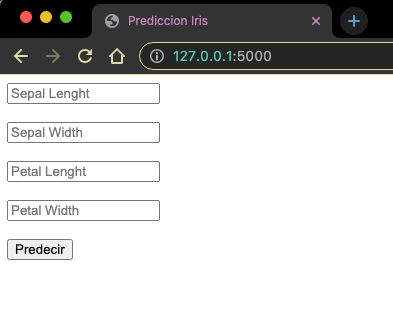
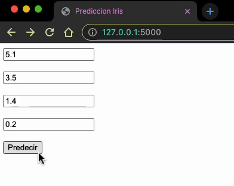

# Proyecto MLOps DevF
## About
En este proyecto pongo un modelo de Machine Learning en producción con Flask al igual hago una imagen con Docker para un uso futuro.

## Introudccion
Este proyecto es parte del módulo de Machine Learning en producción del masterclass en Ciencia de Datos, este proyecto nos ayudara a unir los conceptos de Aprendizaje automático y empezar a ponerlo en producción con conocimientos en Linux, redes, servidores y con herramientas como Airflow para poder crear todo un proceso desde la recolección de datos, el entrenamiento y poner el modelo en producción, ya sea un api o una aplicación web o de otros tipos.

# Proceso 
## Dataset
El primer paso en todo proyecto de programación es definir un problema, ya que tenemos definido el problema, lo siguiente es encontrar el dataset adecuado para poder entrenar el modelo, en este caso para hacerlo más practico y dedicarnos solo a proceso como tal del área de MLOps, usamos el dataset por defecto de scikit-learn de Iris.
## Modelo
En caso del modelo también hicimos este ejercicio enfocado en el área de MLOps, por eso elegimos una regresión logística, la cual nos dio un Score de aproximadamente 90% de efectividad, ya que entrenamos el modelo lo guardamos con la ayuda de la librería joblib en un archivo con formato pickle para poder usarlo en un futuro.
## Implementacion
Para la aplicación del modelo opté por desplegarlo en una aplicación web con la ayuda del Framework de Flask que me permite desplegar un servidor web, para esto decidí informarme más sobre este Framework y gracias a esto pude programar un formulario y a partir de este, recopilar los datos para hacer la predicción, igual de esta manera podría agregarle estilos en un futuro y una mejor presentación.
## Alojamiento Web
Para alojar mi aplicación web elegí Amazon Web Services pues me parece muy amigable ya que eh trabajado previamente con la plataforma, para iniciar accedí al panel de EC2 y lance una nueva instancia con un sistema operativo Ubuntu 22.04 y opté por una maquina t2 micro, ya que me brinda más memoria RAM y es apto para la capa gratuita, escogí 10gb de memoria para la instancia y abrí el puerto 5000 de tcp que es por el cual Flask trabaja por defecto , descargue mi clave ssh para poder conectarme desde mi máquina para poder empezar a configurar el servidor y poder subir mi aplicación web.
## Configuracion
Primero para poder acceder a la instancia de AWS tenemos que conectarnos por ssh, para eso ocupe el comando en consola de:
```bash
$ ssh -i "serverMLops.pem" ubuntu@ec2-54-226-236-135.compute-1.amazonaws.com
```
Ahora vamos a verificar que tenemos instalado Python y si no, lo instalaremos, para verificar solo tenemos que hacerlo con el siguiente comando en consola:
```bash
$ python --version
```
Sí la consola nos dice que no conoce el comando o tenemos una versión de Python inferior a Python3, lo que haremos es instalar python3 con el siguiente comando, como estamos trabajando con Ubuntu usaremos aptitude y para eso escribiremos esto en la consola:
```bash 
$ sudo apt install python3
```
una ves instalado python hay que actualizar pip3 que es el instalador de paquetes de python
para poder instalar bien todos los paquetes de python que necesitamos para correr el proyecto para eso usaremos el siguiente comando:
```bash
$ pip3 install --upgrade pip
```
Ya que el proyecto está alojado en GitHub lo único que hare es clonar el repositorio en una carpeta de la instancia con el comando:
```bash
$ git clone https://github.com/SebastianZR/ProyectMLops.git
```
Bajará una copia del repositorio a la máquina, solo ingresamos a esa carpeta y activamos el entorno virtual que viene ya en el proyecto y tiene todo lo necesario para poder correr la aplicación con el siguiente comando:
```bash
$ source env/bin/activate
```
## Correr aplicacion
El comando visto anteriormente ya deja listo nuestro entorno para ejecutar la aplicación, hay dos formas de desplegar la aplicación, la primera es correrla directamente con Python con el siguiente comando:
```bash
python main.py
```
Una vez hecho esto ya estará arriba nuestra aplicación en el servidor, solo tenemos que compartir el enlace de nuestro servidor e ingresar por el puerto 5000, si queremos que solo al ingresar veamos la app podemos configurar el Flask por el puerto 80 para que sea por default.
  
La segunda forma de correrlo es usando Docker ya que tenemos Dockerfile para poder crear la imagen y correrla lo único que tenemos que hacer es instalar Docker donde lo queramos correr, abrir la carpeta del proyecto y correr el siguiente comando para crear la imagen en nuestro equipo: 
```bash 
$ docker build -t mlops-ml .
```
Lo que hicimos con este comando es crear la imagen a partir del Dockerfile de la carpeta y la llamamos mlops-ml, el punto es para usar todo lo que está en la carpeta, lo que falta ahora es correr la imagen y lo haremos con el siguiente comando:
```bash
$ docker run -it -p 5000:5000 -d mlops-ml
```
Lo que hace este comando es correr la imagen mlops-ml y hacerlo por el puerto 5000 tanto del sistema operativo como el de la maquina local, después de esto podemos abrir el navegador y ya estará corriendo la aplicación.
## Vista de la aplicacion y uso

   
  
    
Para utilizar la aplicación solo tenemos que introducir con numero la longitud y anchura del sépalo y del pétalo y apretar el botón de predecir, una vez hecho esto lanzara una predicción del modelo. Anexo un gif con un ejemplo de cómo se usa:


